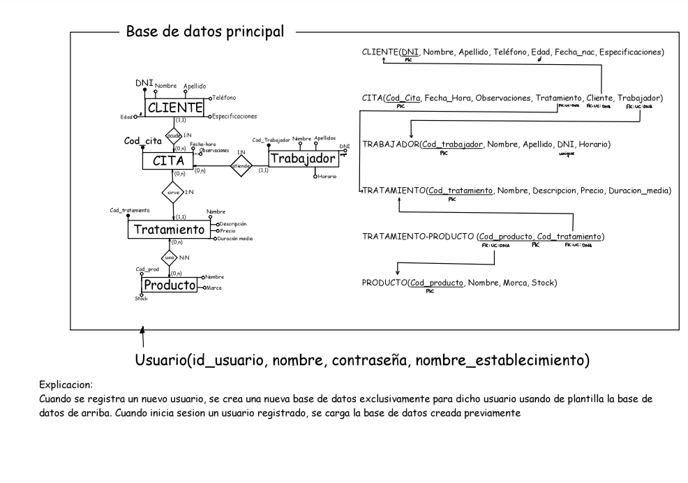

# Proyecto de Fin de 1º de DAM: Aplicación de gestión de tienda

  Este proyecto ha sido llevado a cabo entre dos estudiantes, juntando todos los conocimientos adquiridos en el primer curso de Desarrollo de Aplicaciones Multiplataforma. 
  Abarca muchos contenidos dados, como:
  <ul>
    <li>Uso de estructuras de control y atributos y métodos estáticos, públicos y privados de Java</li>
    <li>Uso de interfaces Visuales con JavaFX</li>
    <li>Uso de operaciones CRUD con datos (Programación Orientada a Objetos)</li>
    <li>Manipulación de Datos en una base de datos (JDBC, utilizando MySQL Server)</li>
  </ul>
  Es un proyecto muy importante, ya que abarca todo un año (bastante complicado por distintos asuntos) aprendiendo y experimentando

  
Progreso actual del proyecto: 
    10/31 clases completadas 
    /6 escenas hechas
    
  
  

## Progreso
### 1. Diseño EER y Relacional de la base de datos
<ol>
  <li>He creado un modelo que implica dos bases de datos (Erik, 30/04/2024)</li>
  <ul>
    <li>La primera se encarga de guardar los distintos usuarios, tanto su base de datos como sus claves</li>
    <li>La segunda se encarga de lo que es la base de datos principal, guardando información de clientes, tratamientos, etcétera</li>
  </ul>
</ol>

### 2. Clases normales
<ol>
  <li>He empezado creando las clases principales, con sus atributos y sus métodos constructor, getter y setter (Erik, 07/05/2024)</li>
  <li>Luego, he empezado por el que va a tener el Login: la clase Usuario y con ello su clase de acceso de datos (DAO) (Erik, 09/05/2024)</li>
  <li>Login terminado totalmente (Erik, 12/05/2024)</li>
</ol>

### 3. Diseños FXML
<ol>
   <li>He terminado el diseño principal de todo lo que es el login</li>
</ol>

### 4. Clases DAO
<ol>
   <li>Empecé con la clase DAO de Usuario, añadiendo los métodos de registro, borrado y un check para ver si el usuario a introducir existe. (Erik, 07/05/2024)</li>
   <li>Tras luchar con muchos intentos fallidos y usuarios creados de forma aleatoria, el registro funciona perfectamente (Erik, 12/05/2024)</li>
</ol>

### 5. Controladores
<ol>
   <li>He comenzado a meter algunas funciones en el controlador del login/signup principal, además de terminar de preparar el sign up (Erik, 12/05/2024)</li>
   <li>He logrado terminar todo el sistema del login con mucha paciencia (Erik, 12/05/2024)</li>
</ol>

## Cambios y Arreglos

<!--
DIARIO DE CAGADAS DE ERIK:
1. EL REGISTER NO FUNCA PORQUE PATATAS
   Solucionado (gracias a dios) haciendo que la conexión no vaya ligada directamente a una base de datos
2. EL REGISTER AHORA DA PROBLEMAS AL INTENTAR HACER LA BASE DE DATOS AAAAAAAAAA
   Solucionado cambiando de una sentencia preparada a una sentencia normal
3. EL REGISTER AHORA DA PROBLEMAS AL INTENTAR DAR PERMISOS
   SOY PUTO LELO Y NO ME FIJE EN QUE ESTABA USANDO OTRO STATEMENT DIFERENTE
-->